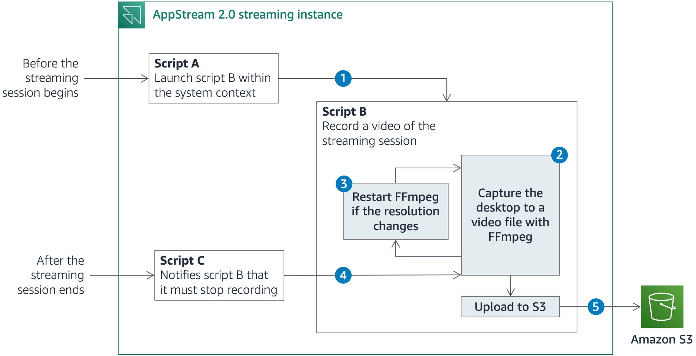

# How to record a video of Amazon AppStream 2.0 streaming sessions

The solution lets you record a video of AppStream 2.0 streaming sessions by using [FFmpeg](https://ffmpeg.org/), a popular media framework. For more information, see the AWS Security Blog post [How to record a video of Amazon AppStream 2.0 streaming sessions](https://todo/).

## Overview and architecture

AppStream 2.0 enables you to run [custom scripts](https://docs.aws.amazon.com/appstream2/latest/developerguide/use-session-scripts.html) to prepare the streaming instance before the applications launch or after the streaming session has completed. Figure 1 shows a simplified description of what happens before, during and after a streaming session.



1. Before the streaming session starts, AppStream 2.0 runs [script A](https://todo/), which uses [PsExec](https://docs.microsoft.com/en-us/sysinternals/downloads/psexec), a utility that enables administrators to run commands on local or remote computers, to launch script B. Script B then runs during the entire streaming session. PsExec can run the script as the [LocalSystem](https://docs.microsoft.com/en-us/windows/win32/services/localsystem-account) account, a service account that has extensive privileges on a local system, while it interacts with the desktop of another session. Using the LocalSystem account, you can use FFmpeg to record the session screen and prevent AppStream 2.0 users from stopping or tampering with the solution, as long as they aren’t granted local administrator rights.

2. [Script B](https://todo/) launches FFmpeg and starts recording the desktop. The solution uses the FFmpeg built-in screen-grabber to capture the desktop across all the available screens.

3. When FFmpeg starts recording, it captures the area covered by the desktop at that time. If the number of screens or the resolution changes, a portion of the desktop might be outside the recorded area. In that case, script B stops the recording and starts FFmpeg again.

4. After the streaming session ends, AppStream 2.0 runs [script C](https://todo/), which notifies script B that it must end the recording and close. Script B stops FFmpeg.

5. Before exiting, script B uploads the video files that FFmpeg generated to [Amazon Simple Storage Service (Amazon S3)](https://aws.amazon.com/s3/). It also stores [user and session metadata](https://docs.aws.amazon.com/appstream2/latest/developerguide/customize-fleets.html#customize-fleets-persist-environment-variables) in Amazon S3, along with the video files, for easy retrieval of session recordings.

For a more comprehensive understanding of how the session scripts works, you can refer to the next section, where I go into the details of each script.

## The solution scripts

In this section, I go into the details of each of the PowerShell scripts that compose the solution.

### Before the streaming session begins

The solution runs the following script within the system context before streaming sessions start. We wait until the user session is active, and we save the session ID and user name for later use.

```
while ($True) {
  $SessionActive = $False
  $Sessions = @(query session) -split '\n' | Select-Object -Skip 1
    
  foreach($Session in $Sessions) {
    $ParsedSession = $Session -split '\s{2,}'
    $SessionUserName = $ParsedSession[1]
    $SessionId = $ParsedSession[2]
    $SessionState = $ParsedSession[3]
    if ($SessionState -eq 'Active') {
      $SessionActive = $True
      Break
    }
  }

  if ($SessionActive) {
    Break
  }
  else {
    Start-Sleep -Seconds 1
  }
}
```

The script launches a second PowerShell script, shown following, with [PsExec](https://docs.microsoft.com/en-us/sysinternals/downloads/psexec). We use PsExec because it can run a program as the [LocalSystem](https://docs.microsoft.com/en-us/windows/win32/services/localsystem-account) account so that the program interacts with the desktop of another session. By doing so, we can record the session screen, while preventing AppStream 2.0 users from stopping or tampering with the solution, as long as they aren’t granted local administrator rights.

```
C:\SessionRecording\Bin\PsExec64.exe -d -i $SessionId -s -accepteula C:\Windows\system32\WindowsPowerShell\v1.0\powershell.exe -NonInteractive -WindowStyle Hidden -File C:\SessionRecording\Scripts\main.ps1 -UserName $SessionUserName
```

At this stage, the streaming session starts, and the script that was launched with PsExec runs during the entire session lifetime.

### During the streaming session

AppStream 2.0 provides [metadata about users, sessions, and instances](https://docs.aws.amazon.com/appstream2/latest/developerguide/customize-fleets.html#customize-fleets-persist-environment-variables) through Windows environment variables. For the solution in this blog, we store user and session metadata in Amazon S3 for easy retrieval of session recordings. User and session metadata is only available within the user context, but environment variables that exist within another context can be obtained from the registry. We retrieve the session user’s Security ID (SID) and we fetch the environment variables from the registry.

```
param ($UserName)
$Domain = ((gcim Win32_LoggedOnUser).Antecedent | Where-Object {$_.Name -eq $UserName} | Select-Object Domain -Unique).Domain

$User = New-Object System.Security.Principal.NTAccount($Domain, $UserName)
$Sid = $User.Translate([System.Security.Principal.SecurityIdentifier]).Value

$UserEnvVar = [ordered]@{}
New-PSDrive -Name HKU -PSProvider Registry -Root HKEY_USERS | Out-Null
$RegKey = (Get-ItemProperty "HKU:\${sid}\Environment")
$RegKey.PSObject.Properties | ForEach-Object {
  $UserEnvVar.Add($_.Name, $_.Value)
}
Remove-PSDrive -Name HKU
```

The script writes the metadata to a text file and uploads it to Amazon S3. We include the stack name, the fleet name, and the session ID in the S3 prefix, so that you can easily find all recordings for a given stack, fleet, or session.

```
$Metadata = @{
  StackName = $UserEnvVar.AppStream_Stack_Name;
  UserAccessMode = $UserEnvVar.AppStream_User_Access_Mode;
  SessionReservationDateTime = $UserEnvVar.AppStream_Session_Reservation_DateTime;
  UserName = $UserEnvVar.AppStream_UserName;
  SessionId = $UserEnvVar.AppStream_Session_ID;
  ImageArn = (Get-Item Env:AppStream_Image_Arn).Value;
  InstanceType = (Get-Item Env:AppStream_Instance_Type).Value;
  FleetName = (Get-Item Env:AppStream_Resource_Name).Value
}

$Content = $Metadata | ConvertTo-Json
Set-Content -Path C:\SessionRecording\Output\metadata.txt -Value $Content

$Date = Get-Date -Format "yyyy-MM-dd_HH-mm-ss"
$Key = "$($BUCKET_PREFIX)$($Metadata.StackName)/$($Metadata.FleetName)/$($Metadata.SessionId)/$($Date)-metadata.txt"
Write-S3Object -BucketName $BUCKET_NAME -Key $Key -File C:\SessionRecording\Output\metadata.txt -Region $BUCKET_REGION -ProfileName appstream_machine_role
```

The script then repeats the following set of commands every second, in an infinite loop.

```
$FfmpegProcess = $null
$CurrentResolution = $null

while ($True) {

  if (!($FfmpegProcess) -or ($FfmpegProcess -and $FfmpegProcess.HasExited)) {
    StartRecording
  }
  
  $NewResolution = (Get-DisplayResolution) -replace $([char]0) | Where-Object { $_ -ne "" }
  if (ResolutionHasChanged -NewResolution $NewResolution) {
    StopRecording
  }
  $CurrentResolution = $NewResolution
  
  UploadVideoFileToS3
    
   if (SessionIsClosing) {
    StopRecording
    WaitUntilAllVideosAreUploaded
    WriteEndMarker
    Break
  }

  Start-Sleep -Seconds 1
}
```

During each loop iteration, these actions happen:

* The script launches FFmpeg if no FFmpeg process exists, or if it has exited. We configure FFmpeg to capture FRAME_RATE frames per second, and to produce one video file every VIDEO_MAX_DURATION seconds whose name contains the time when the recording started. The default value are, respectively, 5 frames per second and 300 seconds. You can adapt these values to your own needs. We redirect the input such that the script can simulate a “q” key press when we need to close FFmpeg.

```
function StartRecording {
  $Date = Get-Date -Format "yyyy-MM-dd_HH-mm-ss"
  $Arguments = "-f gdigrab -framerate $($FRAME_RATE) -t $($VIDEO_MAX_DURATION) -y -v 0 -i desktop -vcodec libx264 -pix_fmt yuv420p C:\SessionRecording\Output\$($Date)-video.mp4"

  $pinfo = New-Object System.Diagnostics.ProcessStartInfo
  $pinfo.FileName = "C:\SessionRecording\Bin\ffmpeg.exe"
  $pinfo.Arguments = $Arguments
  $pinfo.WindowStyle = "Hidden"
  $pinfo.UseShellExecute = $false
  $pinfo.WindowStyle = "Hidden"
  $pinfo.RedirectStandardInput = $true

  $p = New-Object System.Diagnostics.Process
  $p.StartInfo = $pinfo
  $p.Start()
  $p.PriorityClass = "REALTIME"
  $script:FfmpegProcess =  $p
}
```

* We check whether the number of screens or the screen resolution changed. When FFmpeg starts recording, it captures the area covered by the desktop at that time. If the number of screens or the resolution changes, a portion of the desktop might be outside the recorded region. In that case, we stop FFmpeg by simulating a “q” key press. FFmpeg will be restarted during the next loop iteration.

```
function ResolutionHasChanged {
  param($NewResolution)

  if ($script:CurrentResolution -eq $null) {
    return $False
  }

  # Put the variable into an array if the variable has a single line (one screen)
  if (($script:CurrentResolution | Measure-Object -Line).Lines -eq 1) {
    $Current = @($script:CurrentResolution)
  }
  else {
    $Current = $script:CurrentResolution.split('\n')
  }

  if (($NewResolution | Measure-Object -Line).Lines -eq 1) {
    $New = @($NewResolution)
  }
  else {
    $New = $NewResolution.split('\n')
  }

  # If the number of screens differs, return True. Otherwise, check if each screen resolution differs
  if ($Current.Count -ne $New.Count) {
    return $True
  }
  else {
    for ($i = 0; $i -lt $Current.Count; $i++) {
      if ($Current[$i] -ne $New[$i]) {
        return $True
      }
    }
  }

  return $False
}

function StopRecording {
  if ($script:FfmpegProcess -ne $null) {
    $script:FfmpegProcess.StandardInput.Write('q')
  }
}
```

* The script uploads the video files that exist in the local disk, except the video file that is being written by the current FFmpeg process. Once the upload succeeds, we remove the video files from the local disk.

```
function UploadVideoFileToS3 {
  $AllVideosUploaded = $True

  foreach ($Video in (Get-Item -Path C:\SessionRecording\Output\*.mp4)) {

    # I check if the video is being generated by a running FFmpeg process
    $CurrentVideo = $False
    foreach ($Process in (Get-WmiObject Win32_Process -Filter "name = 'ffmpeg.exe'" | Select-Object CommandLine)) {
      if ($Process.CommandLine -like "*$($Video.Name)") {
        $CurrentVideo = $True
        $AllVideosUploaded = $False
      }
    }

    # I upload and delete the video if it is not being generated by FFmpeg
    if ($CurrentVideo -eq $True) {
      Continue
    }
    try {
      $Key = "$($BUCKET_PREFIX)$($Metadata.StackName)/$($Metadata.FleetName)/$($Metadata.SessionId)/$($Video.Name)"
      Write-S3Object -BucketName $BUCKET_NAME -Key $Key -File "C:\SessionRecording\Output\$($Video.Name)" -Region $BUCKET_REGION -ProfileName appstream_machine_role -ErrorAction Stop
      Remove-Item "C:\SessionRecording\Output\$($Video.Name)" -ErrorAction Stop
    }
    catch {
      $AllVideosUploaded = $False
      Continue
    }
  }

  # I return True if there are no more pending videos to upload
  return $AllVideosUploaded
}
```

* The last command in the loop is discussed in the next section.

### After the streaming session ends

AppStream 2.0 runs a third script within the system context after the streaming sessions ends. This script writes a file named ended.txt to the local disk, which is used to notify the second script that the session ended. Then, the third script waits until the second script deletes that file.

```
Set-Content -Path C:\SessionRecording\Scripts\ended.txt -Value "ended"

while ((Test-Path -Path C:\SessionRecording\Scripts\ended.txt)) {
  Start-Sleep -Seconds 1
}
```

The last command in the loop of the second script checks whether this file exists. If it exists, the second script stops FFmpeg, uploads the video files to Amazon S3 until all pending video files are successfully uploaded, and exits the loop.

```
function SessionIsClosing {
   return (Test-Path C:\SessionRecording\Scripts\ended.txt)
}

function WaitUntilAllVideosAreUploaded {
  # I retry 5 times to upload the remaining videos
  for ($i=0; $i -lt 5; $i++) {
    if ((UploadVideoFileToS3) -eq $True) {
      Break
    }
    else {
      Start-Sleep -Seconds 1
    }
  }
}
```

After the loop exited, the second script deletes the file ended.txt, and both the second and third scripts terminate.

```
while ($True) {
  try {
    Remove-Item C:\SessionRecording\Scripts\ended.txt -ErrorAction Stop
    Break
  }
  catch {
    # I retry if the file failed to delete because it is locked
    Start-Sleep -Seconds 1
    Continue
  }
}
```

## Security

See [CONTRIBUTING](CONTRIBUTING.md#security-issue-notifications) for more information.

## License

This library is licensed under the MIT-0 License. See the LICENSE file.

